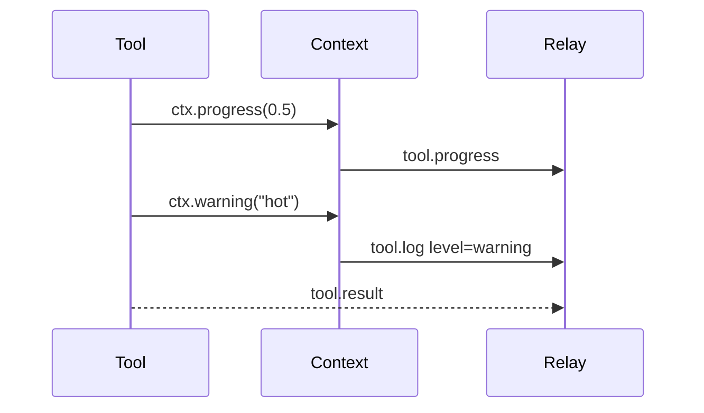

# LabOS Tool Client

`labos.mcp` lets a local device expose Python functions to a remote relay over WebSockets with a FastMCP-style decorator API. It is designed for tools that run behind NAT or firewalls, such as laptops, robots, instruments, desktop apps, and local lab services.

```text
+-----------------------+     WSS Authorization Bearer     +-------------+     tool.call / tool.result      +-----------------+
| @mcp.tool() functions | -------------------------------> | LabOS relay | -------------------------------> | LangChain agent |
+-----------------------+                                  +-------------+                                  +-----------------+
```

The local device opens an outbound WebSocket connection, registers its tools, and waits for calls. The relay authenticates the device, forwards agent tool calls, and streams results, progress, warnings, files, approvals, and fatal device events back to the agent framework.

## Install

Install the library for local development:

```shell
pip install -e .
```

Install directly from GitHub:

```shell
pip install "git+https://github.com/cong-lab/LabOS-Python-API.git"
```

Install the example relay dependencies, including `aiohttp` for the upload side-channel and LangChain packages for the optional agent demo:

```shell
pip install -e ".[examples]"
```

## Quickstart

Create a remote tool client with `RemoteMCP`, decorate functions with `@mcp.tool()`, and call `mcp.run()` to connect to the relay.

The more secure way to configure the client is with a local `.env` file. By default, the LabOS SDK reads `.env` from the current working directory if it exists and ignores it if it does not. Copy `.env.example` and set:

```shell
LABOS_URL=wss://example.com/remote
LABOS_API_KEY=your-tool-key
LABOS_DEVICE_ID=demo-device
```

Then initialize the client without embedding credentials in source code:

```python
from labos.mcp import RemoteMCP

mcp = RemoteMCP()
```

You can also pass values directly. Constructor arguments always override values from `.env`.

```python
from labos.mcp import RemoteMCP

mcp = RemoteMCP(
    url="wss://example.com/remote",
    api_key="your-tool-key",
    device_id="demo-device",
)

@mcp.tool()
def add(a: int, b: int) -> int:
    """Add two numbers."""
    return a + b

if __name__ == "__main__":
    mcp.run()
```

For a local demo, start `examples/example_server.py`, then run `examples/example_client.py` in another terminal.

## Defining Tools

`@mcp.tool()` registers a Python callable as a remote tool. Type hints become the JSON input schema, the return annotation becomes a best-effort output schema, and the docstring becomes the tool description.

```python
@mcp.tool(
    name="read_temperature",
    description="Read the current temperature from the lab sensor.",
    risk="low",
    user_confirmation=False,
)
def read_temperature(units: str = "C") -> float:
    return 21.5 if units == "C" else 70.7
```

Both `def` and `async def` are supported. Sync tools run in a worker thread; async tools run directly on the event loop.

## Context

Add a `ctx: Context` parameter to opt into per-call helpers. The client injects it automatically and excludes it from the generated JSON schema, so agents only see the real tool arguments.

```python
from labos.mcp import Context

@mcp.tool()
async def inspect_sample(sample_id: str, ctx: Context) -> dict:
    await ctx.info("starting inspection", sample_id=sample_id)
    return {"sample_id": sample_id, "status": "ok"}
```

`Context` is implemented in `src/labos/mcp/context.py`.

## Progress

Use `ctx.progress(value, message)` for long-running calls. `value` is a float from `0.0` to `1.0`.

```python
@mcp.tool()
async def long_running(steps: int, ctx: Context) -> str:
    """Demo of streaming progress."""
    for index in range(steps):
        await ctx.progress((index + 1) / steps, f"step {index + 1}/{steps}")
        await asyncio.sleep(0.25)
    return "done"
```

Progress is sent as `tool.progress` and can be surfaced by the relay to a UI, agent trace, or logs.

## Logs And Warnings

Use `ctx.debug`, `ctx.info`, `ctx.warning`, and `ctx.error` to send structured log messages during a call. Extra keyword arguments are sent as structured fields.

```python
@mcp.tool()
async def monitor_lamp(ctx: Context) -> str:
    await ctx.info("starting lamp monitor")
    await ctx.warning("lamp temperature high", temp_c=92.4)
    return "monitoring"
```

These messages are sent as `tool.log` with `level`, `message`, `timestamp`, and `fields`.

## Fatal Events

Use `ctx.fatal(code, message, **fields)` when the device enters an unsafe or terminal state, such as a robot collision. It sends `tool.fatal` and then raises `ToolFatalError` so the tool unwinds immediately.

```python
@mcp.tool()
async def simulate_collision(ctx: Context) -> str:
    await ctx.fatal("collision", "arm hit obstacle", axis="x")
    return "unreachable"
```

The example relay marks a session unhealthy after `tool.fatal` and refuses new calls until reconnect.

## Structured Events

Use `ctx.emit(name, payload)` for domain events that are not logs or numeric progress.

```python
@mcp.tool()
async def load_sample(slot: int, ctx: Context) -> str:
    await ctx.emit("sample.loaded", {"slot": slot})
    return "loaded"
```

Structured events are sent as `tool.event`, which lets the relay or website react without parsing free-form log text.



## File Uploads

`Context` can send bytes or files as attachments. The returned `Attachment` has `id`, `name`, `mime_type`, `size_bytes`, and `sha256`; include the attachment id in your tool result.

| Transport | Best for | How it works |
| --- | --- | --- |
| `inline` | Small payloads | Sends base64 data in one `tool.attachment.start` message. |
| `chunked` | Medium payloads | Sends `tool.attachment.start`, multiple chunks, then `tool.attachment.end`. |
| `upload` | Large payloads | Requests a relay-provided upload URL, performs HTTP PUT, then references the URL. |
| `auto` | Default | Uses `inline` up to 256 KB, `chunked` up to 50 MB, then `upload`. |

Inline bytes:

```python
@mcp.tool()
async def scan_inline(ctx: Context) -> dict:
    attachment = await ctx.send_bytes(
        b"inline scan",
        name="inline.txt",
        mime_type="text/plain",
        transport="inline",
    )
    return {"attachments": [attachment.id]}
```

Chunked bytes:

```python
@mcp.tool()
async def scan_chunked(ctx: Context) -> dict:
    attachment = await ctx.send_bytes(
        b"chunked scan payload",
        name="chunked.bin",
        mime_type="application/octet-stream",
        transport="chunked",
    )
    return {"attachments": [attachment.id]}
```

Out-of-band upload:

```python
@mcp.tool()
async def scan_upload(ctx: Context) -> dict:
    attachment = await ctx.send_bytes(
        b"uploaded scan payload",
        name="uploaded.bin",
        mime_type="application/octet-stream",
        transport="upload",
    )
    return {"attachments": [attachment.id]}
```

Files work the same way:

```python
@mcp.tool()
async def send_report(ctx: Context) -> dict:
    attachment = await ctx.send_file("report.csv", mime_type="text/csv")
    return {"report_attachment": attachment.id}
```

For `upload`, the relay must answer `tool.upload_url.request` with a URL. The demo relay uses an unauthenticated localhost `aiohttp` endpoint only for development.

## User Confirmation

For high-risk actions, mark the tool with `user_confirmation=True` and call `ctx.request_approval(...)`. The relay prompts a human and returns a `tool.approval.response`.

```python
@mcp.tool(risk="high", user_confirmation=True)
async def move_to(x: float, y: float, ctx: Context) -> str:
    """Move a robot after operator approval."""
    approved = await ctx.request_approval(
        f"Move arm to ({x}, {y})?",
        risk="high",
        timeout=30,
    )
    if not approved:
        raise PermissionError("rejected by operator")
    return f"moved to ({x}, {y})"
```

If no response arrives before `timeout`, `ctx.request_approval` raises `ApprovalTimeoutError`.

## Sync Cancellation

Async tools receive cancellation through `asyncio.CancelledError`. Sync tools should poll `ctx.cancelled` because they run in a worker thread.

```python
@mcp.tool()
def long_blocking(ctx: Context) -> int:
    """Demo of sync cancellation via ctx.cancelled."""
    iterations = 0
    while not ctx.cancelled:
        time.sleep(0.05)
        iterations += 1
    return iterations
```

You can also register cleanup hooks:

```python
@mcp.tool()
def motor_run(ctx: Context) -> str:
    ctx.on_cancel(lambda: print("stopping motor"))
    while not ctx.cancelled:
        time.sleep(0.05)
    return "stopped"
```

## Lifespan Hooks

Use lifespan decorators to open and close local resources around the client run loop and each WebSocket connection.

```python
@mcp.on_startup
async def open_hardware() -> None:
    print("opening demo hardware")

@mcp.on_shutdown
async def close_hardware() -> None:
    print("closing demo hardware")

@mcp.on_disconnect
async def disconnected(_ws) -> None:
    print("relay disconnected")
```

`on_startup` runs once before the reconnect loop. `on_connect` and `on_disconnect` run for every WebSocket connection. `on_shutdown` runs when `run_async()` exits.

## Runtime Tool Updates

Tools can be added or removed after the initial registration. When connected, `add_tool` and `remove_tool` emit `tools.update` so the relay can refresh its registry.

```python
def multiply(a: int, b: int) -> int:
    return a * b

@mcp.on_connect
async def add_runtime_tool(_ws) -> None:
    await mcp.add_tool(
        multiply,
        description="Multiply two numbers added after initial registration.",
    )
```

Remove a tool by name:

```python
await mcp.remove_tool("multiply")
```

## Error Handling

The client returns `tool.error` when a call fails. Common error codes:

| Code | Meaning |
| --- | --- |
| `not_found` | The relay called an unknown tool name. |
| `invalid_arguments` | Pydantic validation failed for the input schema. |
| `timeout` | The `tool.call.timeout_ms` deadline expired. |
| `cancelled` | The relay sent `tool.cancel` or the in-flight task was cancelled. |
| `tool_error` | The tool raised an unexpected exception. |

Fatal device states are separate from normal call errors. Use `ctx.fatal(...)` when the device should be considered unhealthy.

## Heartbeats And Idempotency

`RemoteMCP` sends `tool.heartbeat` periodically while connected. Set `heartbeat_interval` to tune the cadence.

```python
mcp = RemoteMCP(
    url="wss://example.com/remote",
    api_key="your-tool-key",
    heartbeat_interval=15,
    idempotency_cache_size=256,
)
```

The idempotency cache stores recent `tool.result` and `tool.error` payloads by call id. If the relay repeats a completed call id, the cached response is sent without re-running the tool. Duplicate in-flight calls with the same id are coalesced and receive the first execution's response.

## Reconnection

By default, `RemoteMCP` reconnects forever with exponential backoff from 1 second up to 30 seconds.

```python
mcp = RemoteMCP(
    url="wss://example.com/remote",
    api_key="your-tool-key",
    reconnect=True,
)
```

Use `reconnect=False` for one-shot scripts that should fail fast if the relay disconnects.

## Wire Protocol

The wire protocol is JSON over WebSocket. `src/labos/mcp/protocol.py` defines the Pydantic message models and discriminated `Message` union.

| Category | Messages |
| --- | --- |
| Registration | `tools.register`, `tools.update`, `hello` |
| Calls | `tool.call`, `tool.result`, `tool.error`, `tool.cancel` |
| Status | `tool.progress`, `tool.log`, `tool.fatal`, `tool.event`, `tool.heartbeat` |
| Attachments | `tool.attachment.start`, `tool.attachment.chunk`, `tool.attachment.end`, `tool.upload_url.request`, `tool.upload_url.response` |
| Human approval | `tool.approval.request`, `tool.approval.response` |

See `DOCUMENTATION.md` for the long-form architecture and security notes.

## Running The Demo Relay

Start the relay:

```shell
python examples/example_server.py
```

Start the client in another terminal:

```shell
python examples/example_client.py
```

The demo relay listens on:

- `ws://localhost:8765/remote` for the WebSocket relay.
- `http://localhost:8766` for the upload side-channel and `/devices`.

Run the scripted demo once:

```shell
LABOS_EXAMPLE_RUN_ONCE=1 python examples/example_server.py
```

Run the optional LangChain agent demo:

```shell
OPENAI_API_KEY=... LABOS_EXAMPLE_LANGCHAIN=1 python examples/example_server.py
```

The LangChain demo requires `pip install -e ".[examples]"`.

## Current Limitations

- Resume tokens and reconnect session continuity are not implemented yet.
- Resources and prompts (`@resource`, `@prompt`) are out of scope for now.
- Server-pushed tool reconfiguration is not implemented; `tools.update` is client-to-relay only.
- The example upload side-channel is unauthenticated and stores files in memory. It is for localhost demos only.
- The example relay is intentionally small. A production relay should add persistent storage, authz scopes, audit logs, rate limits, upload quotas, and a real human approval queue.
